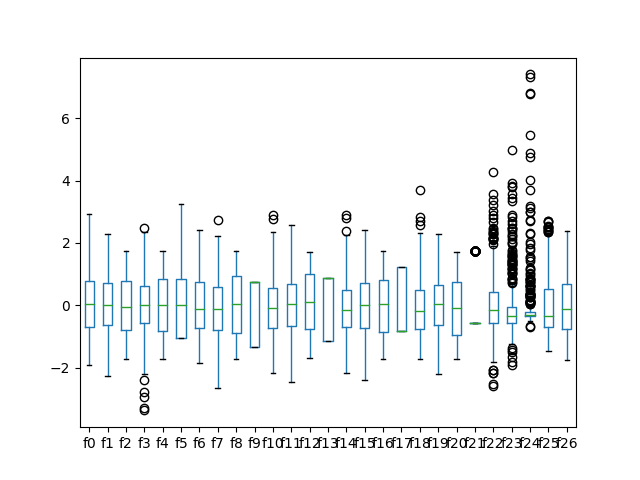
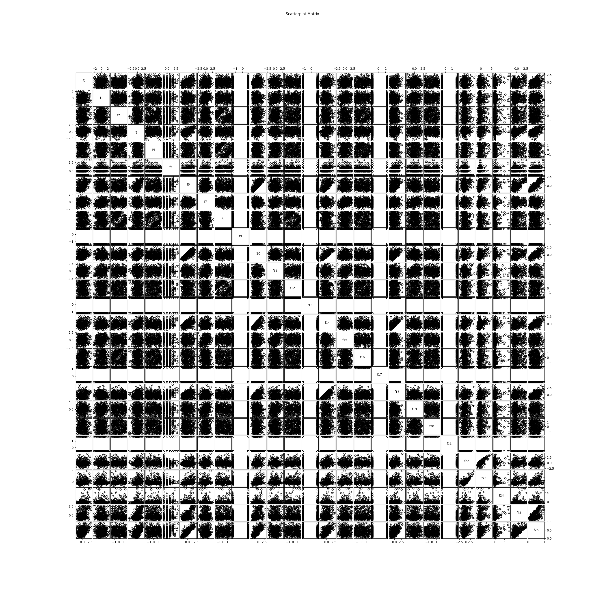

# SignalDetection

This repository contains an analysis of the [HEPMASS](http://archive.ics.uci.edu/ml/datasets/HEPMASS) data set from the _UCI Machine Learning Repository_. It's goal is to detect signals generated by particle-producing collisions. The analysis consists of the following parts:

* Description of the data set and its attributes
* Data preprocessing (e.g. Cleaning, handling missing values, ...)
* Classification by several classification strategies
* Evaluation of the results

## Installation

The analysis is performed with python3 and visualised in [Jupyter Notebooks](http://jupyter.org/). You can install and run jupyter with the following commands:

```
$ pip install jupyter
$ jupyter notebook
```

We use [dask dataframes](http://dask.pydata.org/en/latest/) to read and process large csv files. You can install it by running

```
$ pip install dask[dataframe]
```

## Usage

This analysis relies on large data files, which will not be uploaded to Github. Code blocks which use these data files will not properly be displayed online. To run these code blocks, download the repository via HTTPS or SSH:
```
$ git clone https://github.com/tsabsch/SignalDetection.git
$ git clone git@github.com:tsabsch/SignalDetection.git
```
and run it on a local jupyter instance.

The data files are assumed to be within the directory `data`. If you have placed your data files elsewhere, you have to update the code to fit your path.

## Remarks
This analysis has been made as part of the course [__Advanced Topics in Machine Learning__](http://www.findke.ovgu.de/findke/en/Studies/Courses/Summer+Term+2017/Advanced+Topics+in+Machine+Learning.html) at the Otto-von-Guericke-University Magdeburg.


## Concept
The analysis should fulfill several criteria: Firstly, the data needs to be cleaned in order to handle missing values and potential outliers. Secondly, two machine learning algorithms should be selected for classification, both providing an online (stream-based) as well as an offline variant.

In the following, the prepared concept for these requirements is presented in detail.

### Preprocessing
Data preparation is started by checking for __missing or erroneous data__. Furthermore, we want to ensure that there is an __equal distribution of classes__, because otherwise we might need to consider data augmentation methods.

As more advanced preprocessing steps we plan on performing __outlier detection__, finding __correlations between certain features__ and applying __Principal Component Analysis__ (PCA). Boxplots on single features for a subsample of the data already gave us a first idea about the presence of outliers:


In order to investigate feature correlations, we inspected all dual combinations of features as can be seen in the following plots. Again only a subsample of the data set was used.


### Classification
The first approach to be used for classification will be a __Multilayer Perceptron__ (MLP). It should work well for the high number of features in our data set and natively supports online and offline application, because it can be trained in batches. A working module is available from [Scikit-learn](http://scikit-learn.org/stable/modules/generated/sklearn.neural_network.MLPClassifier.html)

